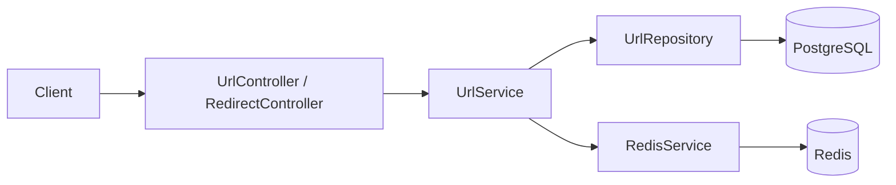

# URL Shortener

A Spring Boot backend that creates short codes for HTTP(S) URLs, redirects short-code requests to their original URLs, and records click counts.

## Features

- Create a six-character short code for a validated HTTP(S) URL.
- Check generated codes against PostgreSQL and enforce uniqueness at the database column level.
- Persist URL records, creation time, optional expiration time, and click count in PostgreSQL.
- Redirect `/{shortCode}` requests with HTTP `302 Found`.
- Reject expired links when they are loaded from PostgreSQL.
- Cache short-code-to-original-URL mappings in Redis using cache-aside reads.
- Use a one-hour Redis TTL for non-expiring URLs and an expiration-aligned TTL for expiring URLs.
- Increment and persist the click count on each successful redirect, including Redis cache hits.
- Validate URL-creation requests and return structured `404` errors for unknown or expired short codes.
- Run the application, PostgreSQL, and Redis with Docker and Docker Compose.

## Tech Stack

- Java 25
- Spring Boot 4.1.0
- Spring MVC / Spring Web MVC
- Spring Data JPA (Hibernate)
- Spring Data Redis
- PostgreSQL 18
- Redis 8
- Jakarta Bean Validation
- Maven (with Maven Wrapper)
- Docker and Docker Compose
- JUnit Jupiter / Spring Boot test starters

## Architecture

The application follows a simple layered design. Controllers expose HTTP endpoints, `UrlService` contains shortening, lookup, expiration, and click-count logic, `UrlRepository` persists `Url` entities, and `RedisService` wraps Redis string operations. Redis is a cache; PostgreSQL remains the source of persistent URL and analytics data.



## Request Flow

### A. Creating a short URL

`POST /api/urls` validates the request body, generates a random code, checks PostgreSQL for a collision, validates that an optional expiration is in the future, and saves the entity. The service then writes the original URL to Redis: for an expiring URL, with a TTL calculated from `expiresAt`; otherwise, with a one-hour TTL.

### B. Redirecting using a short code

`GET /{shortCode}` asks `UrlService` for the original URL. On success, the controller sends `302 Found` with the original URL in the `Location` header.

### C. Redis cache hit

If Redis contains a value under the short code, the service increments the URL's click count in PostgreSQL and returns the cached original URL. The cache-hit branch does not query the entity to evaluate its `expiresAt` value; expiration is normally bounded by the TTL written to Redis.

### D. Redis cache miss

On a miss, the service loads the URL entity from PostgreSQL. It returns `404` if there is no matching code or if `expiresAt` is before the current time. For a valid URL, it increments the click count, repopulates Redis with the applicable TTL, and returns the original URL.

### E. URL expiration

An optional `expiresAt` is stored as a `LocalDateTime`. Creation rejects a time in the past. On a PostgreSQL-backed lookup, a link is treated as expired when its expiration is before the current time. Expiring links are cached only until the calculated expiration time.

### F. Click tracking

Each successful redirect increments `clickCount` by one and saves the entity through `UrlRepository`. The statistics endpoint returns the persisted entity, including this count. Click updates are synchronous and occur even when the URL value came from Redis.

## API Endpoints

### Create a short URL

`POST /api/urls`

Creates and persists a URL record.

Request body:

```json
{
  "originalUrl": "https://example.com/articles/spring",
  "expiresAt": "2026-12-31T23:59:59"
}
```

`expiresAt` is optional and uses an ISO-8601 local date-time when supplied.

```bash
curl -i -X POST http://localhost:8080/api/urls \
  -H 'Content-Type: application/json' \
  -d '{"originalUrl":"https://example.com/articles/spring"}'
```

Example response (`201 Created`):

```json
{
  "id": 1,
  "originalUrl": "https://example.com/articles/spring",
  "shortCode": "aB3xY9",
  "createdAt": "2026-08-19T12:00:00",
  "expiresAt": null,
  "clickCount": 0
}
```

Relevant status codes: `201 Created`; `400 Bad Request` when bean validation rejects a blank URL or one that does not begin with `http://` or `https://`. An expiration time in the past causes the service to throw `IllegalArgumentException`; there is no application-specific handler for that exception.

### Redirect to the original URL

`GET /{shortCode}`

Resolves a short code and returns an HTTP redirect.

```bash
curl -i http://localhost:8080/aB3xY9
```

Example response (`302 Found`):

```http
HTTP/1.1 302 Found
Location: https://example.com/articles/spring
```

Relevant status codes: `302 Found`; `404 Not Found` for an unknown code or an expired code found during a PostgreSQL lookup.

### Get URL statistics

`GET /api/urls/{shortCode}/stats`

Returns the persisted `Url` entity, including the current click count. This endpoint does not evaluate URL expiration.

```bash
curl -i http://localhost:8080/api/urls/aB3xY9/stats
```

Example response (`200 OK`):

```json
{
  "id": 1,
  "originalUrl": "https://example.com/articles/spring",
  "shortCode": "aB3xY9",
  "createdAt": "2026-08-19T12:00:00",
  "expiresAt": null,
  "clickCount": 3
}
```

Relevant status codes: `200 OK`; `404 Not Found` if the code is absent from PostgreSQL.

### Error response for an unknown or expired short code

The global handler produces this shape for `UrlNotFoundException`:

```json
{
  "timestamp": "2026-08-19T12:05:00",
  "status": 404,
  "error": "Not Found",
  "message": "Short URL not found"
}
```

## Database Design

The JPA entity maps to the `urls` table. With Spring Boot's default physical naming strategy, its Java properties map to snake_case column names.

| Column | Type / role | Constraints |
| --- | --- | --- |
| `id` | `Long` primary key | Generated with identity strategy |
| `original_url` | `String` | Required; maximum length 2048 |
| `short_code` | `String` | Required; maximum length 20; unique |
| `created_at` | `LocalDateTime` | Required |
| `expires_at` | `LocalDateTime` | Optional |
| `click_count` | `Long` | Required; initialized to `0` |

`Url` declares the `idx_short_code` index on `short_code` and also declares `shortCode` as unique. There are no entity relationships. Schema updates are managed by the configured Hibernate setting (`spring.jpa.hibernate.ddl-auto=update`).

## Short Code Generation

`UrlService` generates a six-character code with `java.util.Random`. Each character is selected from:

```text
abcdefghijklmnopqrstuvwxyzABCDEFGHIJKLMNOPQRSTUVWXYZ0123456789
```

After generating a candidate, the service calls `existsByShortCode` and repeats until PostgreSQL reports that the code is unused. The entity's unique `shortCode` column provides an additional database-level uniqueness constraint.

## Redis Caching

Redis stores plain string values: the key is the short code and the value is the original URL. `RedisService` uses `RedisTemplate<String, String>` value operations to read, write, and delete these mappings; the current application flow uses reads and writes, not the delete method.

The service uses cache-aside behavior:

- A newly created URL is immediately cached.
- A redirect first reads Redis. On a hit, it returns the cached original URL after updating the click count in PostgreSQL.
- On a miss, it loads the entity from PostgreSQL, checks expiration, updates the click count, then repopulates Redis before redirecting.

URLs without an `expiresAt` receive a one-hour TTL. For URLs with an expiration, the TTL is `Duration.between(now, expiresAt)`, so Redis should evict the mapping around the URL's expiration. PostgreSQL records are not deleted when either TTL or URL expiration passes.

## URL Expiration

Expiration is optional. The request's `expiresAt` value is stored with the URL record, and a creation request with a past expiration is rejected by the service. On a cache miss, the service compares `expiresAt` with the current `LocalDateTime`; a time before now results in `UrlNotFoundException` and thus a `404` response.

For expiring URLs, Redis is written with the remaining duration. This avoids deliberately caching an expiring URL past its configured expiration, while the database-side check remains the authoritative expiration check after a cache miss.

## Analytics

Analytics consists of a single persisted counter: `clickCount`. It starts at zero when a URL is created, increases synchronously on every successful redirect, and is returned by `GET /api/urls/{shortCode}/stats`. The code does not implement event logs, aggregation jobs, asynchronous processing, or streaming analytics.

## Validation and Error Handling

`CreateUrlRequest.originalUrl` uses these Jakarta Validation constraints:

- `@NotBlank` — rejects empty or whitespace-only URLs.
- `@Pattern(regexp = "^(https?://).+")` — requires the value to start with `http://` or `https://` and contain additional characters.

The controller applies validation with `@Valid`. `GlobalExceptionHandler`, annotated with `@RestControllerAdvice`, converts `UrlNotFoundException` into a structured `404` JSON response containing a timestamp, status, error, and message. No custom handler is defined for validation failures or `IllegalArgumentException`.

## Docker

The `Dockerfile` uses `eclipse-temurin:25-jdk`, copies a prebuilt JAR matching `target/*.jar` to `/app/app.jar`, exposes port `8080`, and starts it with `java -jar app.jar`.

`docker-compose.yml` defines three services:

- `app`, using the locally built `url-shortener:1.0` image and exposing `8080`.
- `postgres`, using `postgres:18`, exposing host port `5433` to container port `5432`, and persisting its data in the named `postgres_data` volume.
- `redis`, using `redis:8` and exposing `6379`.

The app receives database and Redis connection settings through `DB_URL`, `DB_USERNAME`, `DB_PASSWORD`, `REDIS_HOST`, and `REDIS_PORT`. Compose's default network lets the app reach the other services by the `postgres` and `redis` service names. Connection secrets are configured locally through Compose and are intentionally not reproduced here.

## Running Locally

Prerequisites: Java 25, Docker with Docker Compose, and access to Maven (the repository includes `mvnw`).

Build the application JAR without running the context-load test:

```bash
./mvnw clean package -DskipTests
```

Start only PostgreSQL and Redis, then run the Spring Boot application on the host:

```bash
docker compose up -d postgres redis
./mvnw spring-boot:run
```

The application's default configuration targets the ports exposed by those Compose services. The existing test loads the full Spring context, so run it while PostgreSQL is available:

```bash
./mvnw test
```

Test the API from another terminal:

```bash
curl -i -X POST http://localhost:8080/api/urls \
  -H 'Content-Type: application/json' \
  -d '{"originalUrl":"https://example.com"}'

curl -i http://localhost:8080/<shortCode>

curl -i http://localhost:8080/api/urls/<shortCode>/stats
```

Replace `<shortCode>` with the `shortCode` returned by the create request. Stop the supporting containers when finished:

```bash
docker compose down
```

## Running with Docker Compose

The Compose file references a local application image rather than building it, and the Dockerfile requires a JAR in `target/`. Build both before starting the stack:

```bash
./mvnw clean package -DskipTests
docker build -t url-shortener:1.0 .
docker compose up
```

Use `docker compose up -d` to run it in the background and `docker compose down` to stop the containers. The named PostgreSQL volume is retained by `down`; do not add `-v` unless deleting local database data is intended.

## Project Structure

```text
.
├── Dockerfile
├── docker-compose.yml
├── pom.xml
├── src
│   ├── main
│   │   ├── java/url_shortener
│   │   │   ├── UrlShortenerApplication.java
│   │   │   ├── controller/
│   │   │   │   ├── RedirectController.java
│   │   │   │   └── UrlController.java
│   │   │   ├── dto/CreateUrlRequest.java
│   │   │   ├── entity/Url.java
│   │   │   ├── exception/
│   │   │   │   ├── GlobalExceptionHandler.java
│   │   │   │   └── UrlNotFoundException.java
│   │   │   ├── repository/UrlRepository.java
│   │   │   └── service/
│   │   │       ├── RedisService.java
│   │   │       └── UrlService.java
│   │   └── resources/application.properties
│   └── test/java/url_shortener/UrlShortenerApplicationTests.java
└── mvnw
```

## Design Decisions

- **Layered application:** HTTP concerns, application logic, Redis access, and database access are kept in separate controller, service, and repository classes.
- **PostgreSQL persistence:** URL metadata and click counts survive Redis TTL expiry and application restarts.
- **Redis cache-aside access:** Redis reduces original-URL lookups on cache hits, while PostgreSQL supplies data and rebuilds the cache on misses.
- **Uniqueness safeguards:** Candidate codes are checked through the repository before use and constrained as unique in the entity mapping.
- **Containerized local stack:** Compose provides compatible PostgreSQL and Redis services and supplies service-host connection settings to the app container.

## Limitations / Future Improvements

The following are not implemented in the current codebase:

- Rate limiting or abuse prevention.
- Custom aliases and URL management (update or delete) endpoints.
- Asynchronous, event-based, or Kafka-backed analytics.
- Database migrations such as Flyway or Liquibase.
- Authentication, authorization, or multi-user ownership.
- Metrics, tracing, centralized logging, and health-focused operational tooling.
- Redis high availability, load balancing, or horizontal application scaling.
- A full endpoint-level test suite; the existing test only verifies that the Spring application context loads.

## Author

Harsh
